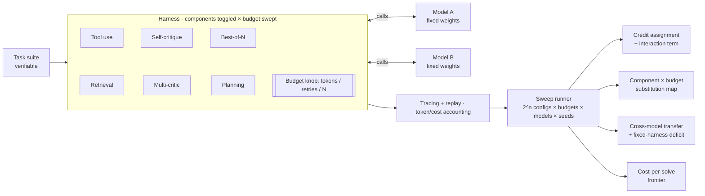

# Elicitation Harness

## What this is

A benchmark number for a language model describes more than just the model itself. It describes the model plus everything wrapped around it: the prompt, whether it can call tools, whether it gets a second attempt, how many tokens it's allowed to burn, how the answer gets graded. That wrapper is usually called the **harness** (or scaffold), and the work of tuning it so the model actually shows what it can do is called **elicitation**.

Nobody disputes that the harness affects the benchmark score. OpenAI, the UK AI Security Institute, and METR have all said so publicly. What nobody has measured is HOW the harness affects it: which pieces of the harness are doing the work, whether those pieces help/hurt each other, how each one compares to just spending more money on tokens, and whether any of that stays the same when you swap in a different model. This repo runs that measurement.

---

## Contents

- [Why bother](#why-bother)
- [What's new here](#whats-new-here)
- [The four things we test](#the-four-things-we-test)
- [How it works](#how-it-works)
- [Install](#install)
- [Quickstart](#quickstart)
- [Components and the budget knob](#components-and-the-budget-knob)
- [Methodology](#methodology)
- [Findings](#findings)
- [How this maps onto evaluation vocabulary](#how-this-maps-onto-evaluation-vocabulary)
- [Repo structure](#repo-structure)
- [Reproducibility](#reproducibility)
- [Who this is useful for](#who-this-is-useful-for)
- [Limitations](#limitations)
- [Prior work](#prior-work)
- [Roadmap](#roadmap)
- [License and citation](#license-and-citation)

---

## Why bother

Research has been done to conclude that benchmark scores depend on the harness. This is now a basic assumption. Here's more information:

- The UK AI Security Institute ran a cyber security evaluation where raising the token budget from 10 million to 100 million improved performance by as much as 59 percent, and the curve hadn't flattened out even at the top of the range.
- HAL (the Holistic Agent Leaderboard) swapped harnesses on the same benchmark, CORE-Bench, and got different scores *and* different costs out of identical models.
- OpenAI's playbook for third party evaluations writes all of this down formally and lists strong elicitation methods as an open problem.

The problem is that every one of those results depends on the whole harness or the whole budget and not the specific contributions of the harness. If the harness is swapped, the number changes, but we don't know exactly which single component was responsible, whether two components together do more than the sum of what they do separately, or how each one stacks up against just using more tokens. This gap is what this project aims to fill.

### The practical version of the same problem

There's a second reason this is worth doing right now. A lot of production traffic is migrating off closed API providers like OpenAI and Anthropic and onto open-weight models, either self-hosted or served by companies that specialize in running open models cheaply (Together, Fireworks, and similar). At scale, the math usually favors using open-weight models.

But calling a closed API gets you more than just model weights. The provider has already written a tuned default system prompt, layered on safety scaffolding, and figured out sensible retry and elicitation behavior. When a company spins up an open-weight model themselves, none of that comes with it. The company now owns the entire elicitation question.

So for those teams this is a build versus buy question. Which scaffold pieces are worth the engineering time, and how much capability does a rushed migration cost you compared to one where somebody actually tuned the harness?

## What's new here

| Already known | What we actually measure |
|---|---|
| The harness changes measured capability | Which components carry the change, with per component credit assignment |
| More budget means higher scores | How components and budget substitute for each other: which components stop mattering once you can afford more tokens, and which don't |
| Swapping whole harnesses changes score and cost | Cost per solved task, broken down per component |
| Standardized and max effort harnesses give different numbers | Whether the per component ranking transfers across models, and if it doesn't, how unevenly a fixed harness shortchanges different models |

If everything on the right comes out flat (credit spread evenly, no interaction with budget, rankings transfer perfectly, no ranking flips), that's still worth reporting. It would mean standardized harnesses are unbiased and cheap evaluations can be trusted, which is also a useful outcome to report.

## The four things we test

**1. Credit is concentrated, and the parts aren't independent.**

We expect a small number of components to account for most of the improvement, and we expect them to interact. The way to check is to measure the gap between the bare model and the full harness, then subtract the sum of what each component contributes on its own. If that leftover is not zero, the harness is more (or less) than the sum of its parts. 

**2. Components and budget partly substitute for each other.**

Run the same analysis at several token budgets. Some components should lose their value as budget rises, because they were buying you something extra compute would have bought anyway. Others should hold their value no matter how much you spend. This is the direct follow up to the AISI budget scaling result: more tokens help, but which parts of the harness are still contributing at 100 million tokens?

**3. The ranking may not transfer. This is the one we care most about.**

Compute the per component ranking separately for each model. Either it's stable across models and sizes, or it isn't. If it isn't, then a single fixed harness is leaving more capability on the table for some models than for others. 

**4. Head to head comparisons can flip.**

Model A beats model B with no scaffolding, then loses once both are fully scaffolded. Or the winner changes when you change the budget. If that happens, then the verdict of a "controlled comparison" depends on a harness decision.

## How it works



Models sit behind Inspect AI's provider layer, so switching from `openai/gpt-4o-mini` to `together/Qwen/Qwen2.5-7B-Instruct-Turbo` is a one line config edit with no code changes.

So far this has only been run against OpenAI's hosted API and Together's hosted open-weight inference. A fully local vLLM endpoint should work through the same interface, since Inspect supports it, but nobody has actually pointed this harness at one yet. Treat that path as designed for, not verified, until someone exercises it.

Each component is a plugin you can switch on or off independently. Budget gets swept as an axis alongside the on/off switches, because otherwise there's no way to tell components and compute apart. The runner works through components × budget × model × seed, and the four analyses at the end are the output.

## Install

```bash
git clone https://github.com/<you>/elicitation-harness && cd elicitation-harness
uv venv --python 3.11 && source .venv/bin/activate
uv pip install inspect-ai openai
uv pip install "inspect_evals @ git+https://github.com/UKGovernmentBEIS/inspect_evals"
cp .env.example .env   # add one provider key
```

## Quickstart

Check that everything works, then run a small slice:

```bash
inspect eval inspect_evals/gsm8k --model openai/gpt-4o-mini --limit 20   # smoke test
inspect view
python run_ablation.py                                                   # component slice
```

Reproduce the main study (components × budget × two models):

```bash
elicit run --config experiments/transfer_and_budget.yaml
elicit report experiments/transfer_and_budget.yaml   # writes results/ + figures/
```

```yaml
# experiments/transfer_and_budget.yaml
models:
  - {name: small, endpoint: http://localhost:8000/v1}   # same family, two sizes
  - {name: large, endpoint: http://localhost:8001/v1}
tasks: suites/swe_verified_mini
components: [tool_use, retrieval, self_critique, multi_critic, best_of_n, planning]
budgets:   [low, mid, high]      # token / retry / N caps, swept as an axis
ablation:  shapley               # exact, over all 2^n component configs
seeds:     5
budget_usd: 60
```

## Components and the budget knob

Each component is one technique for getting more out of a model. The **mode** column marks whether it uncovers ability the model already had (*reveals*) or bolts on a capability the model didn't have (*augments*). Budget, meaning tokens, retries, and sample counts, gets swept separately so you can see components and raw compute trade off against each other.

| Component | Mode | What it does |
|---|---|---|
| Tool use | augments | Lets the model call functions: run code, use a calculator. Usually the single biggest lever. |
| Retrieval | augments | Pulls relevant documents into the prompt. Cuts down on made up answers. |
| Self-critique | reveals | The model reads its own answer and revises it. |
| Multi-critic | reveals | Separate critic models score and argue over the answer. Watch out for circularity if the critic and the benchmark share assumptions. |
| Best-of-N | reveals | Generate N answers, pick one by voting or by judge. Tied very closely to budget, since N *is* budget. |
| Planning | reveals | Break the task into steps before doing any of them. Helps on long tasks, often not worth the tokens on short ones. |

```python
class Component(Protocol):
    name: str
    mode: Literal["reveals", "augments"]
    def wrap(self, call: ModelCall, ctx: TaskContext, budget: Budget) -> ModelCall: ...
```

## Methodology

**Only tasks with checkable answers.** Scores come from running code or comparing against ground truth, never from asking another model whether the answer looks good. GSM8K for quick slices, then SWE-bench Verified Mini, which is graded by actually running the tests.

**Credit assignment using Shapley values, plus an interaction term.** Shapley values come from cooperative game theory. The idea: to work out how much one player contributed to a team, you look at every possible order the players could have joined in, and average how much the score went up when that player showed up. With 6 components there are only 64 combinations, so we run all of them and get the exact answer rather than an estimate. Then we take the full gap between bare and scaffolded, subtract the sum of the individual contributions, and report the leftover. That leftover is the interaction: positive means the components amplify each other, negative means they get in each other's way. We also report plain leave-one-out numbers (turn off one thing, see what you lose) so you can see where the two methods disagree, because they often do.

**The budget sweep.** Redo the whole credit assignment at low, medium, and high budget. The output is a 2D map: component on one axis, budget on the other, contribution as the value. Substitution shows up as a component's contribution fading out to the right.

**Cross model transfer.** Run the credit assignment separately per model, then check whether the two rankings agree using Spearman and Kendall correlation (both are standard ways to ask "do these two ranked lists put things in the same order"). Then, per model, measure the gap between its best configuration and the shared fixed configuration. That gap is how much a standardized harness is costing that particular model.

**Everything normalized by cost.** All results get plotted against tokens and dollars. The headline efficiency number is expected cost per task actually solved, which is more informative than accuracy alone because a config that solves 5 percent more tasks at 4x the price is not obviously better.

**Screening for things that would invalidate the results.** Every run gets checked for reward hacking (the model games the scoring rule instead of doing the task), contamination (the test data was in training data), broken problems (the task itself is unsolvable or mislabeled), refusals, and sandbagging (the model underperforming on purpose). A held out private slice catches contamination on benchmarks that have been floating around the internet for a while.

**Statistics.** At least 5 seeds per configuration. Every number is a mean with a bootstrap confidence interval, which means we resample the results many times to estimate how much the number would wobble if we ran it again. Differences that fall inside the interval get reported as "can't tell these apart," not as small wins. For comparing two configurations we use paired tests (McNemar, or bootstrap on the per task difference) since both configurations ran the same tasks.

## Findings

> The bracketed values below are placeholders that show the shape of each result. Replace them with your own run. The table and every figure regenerate from `results/`.

**Credit and interaction.** On `[small model]` with `[SWE-bench Verified Mini]`, `[two of six]` components account for `[roughly 80%]` of the total improvement. The interaction term is `[+N points]`, meaning the components `[amplify / interfere with]` each other and the harness is not the sum of its parts.

**Substitution with budget.** `[best_of_n / planning]` contributes `[+X at low budget and roughly nothing at high budget]`, while `[tool_use]` holds steady at `[+Y]` across the whole range. Read that as: `[best-of-N]` mostly buys what extra compute would have bought you anyway, and `[tool use]` buys something compute can't.

**Transfer across models.** The component rankings correlate at `[ρ = 0.?]` between `[small]` and `[large]`. `[If that number is low:]` the same fixed harness leaves `[Z points]` more on the table for `[large]` than for `[small]`, which means a fixed harness comparison is `[tilted toward / against]` the bigger model in a way that running more seeds won't fix.

**Flipped comparisons.** With a `[low budget standardized]` harness, `[A beats B]`. With `[max effort elicitation]`, `[B beats A]`. Same models and same tasks, opposite verdict, decided by a harness choice that usually doesn't make it into the writeup.

If it turns out that credit is spread evenly, budget doesn't interact with anything, rankings transfer cleanly, and nothing flips, then standardized harnesses are safe and we report exactly that.

## How this maps onto evaluation vocabulary

Evaluators tend to distinguish two kinds of claim. Running the full scaffold at high budget gives you a **capability under strong elicitation** estimate, which is a lower bound on what the model can do. Running a shared fixed configuration across models gives you a **standardized comparison**, which is what you want when the point is to compare models rather than harnesses.

The interesting quantity is the distance between those two, measured separately for each model. If the distance is the same for everyone, the standardized comparison is fine. If it isn't, the comparison is measuring the harness as much as the models. This tool lets you sit in either regime and see, per component, what each one costs you and what it gets you.

## Repo structure

```
elicitation-harness/
├── src/elicit/
│   ├── models/        # one interface for every provider, hosted or local
│   ├── components/    # toggleable scaffold plugins, all budget-aware
│   ├── budget/        # token/retry/N caps, swept as an axis
│   ├── tasks/         # task loaders and scoring for verifiable tasks
│   ├── runner/        # the components × budget × model × seed sweep, plus cost accounting
│   ├── attribution/   # Shapley, interaction term, transfer metrics
│   └── analysis/      # substitution map, fixed-harness deficit, cost-per-solve frontier
├── experiments/       # studies as config files (transfer_and_budget.yaml, ...)
├── results/           # raw outputs, committed
├── figures/           # regenerated from results/
├── suites/            # task suites
└── writeup/           # the report / blog post
```

The framework doesn't care which models or tasks you point it at. The specific study lives in `experiments/` as one config file, so someone who's never seen the repo can rerun it, or swap in their own models and tasks.

## Reproducibility

Pinned model and dependency versions, fixed seeds, `results/` committed to the repo, one command to regenerate every figure, and full transcripts saved through Inspect.

Worth knowing: even at temperature 0, model outputs are not perfectly reproducible. Batching, hardware differences, and floating point ordering all introduce small variations. That's why every number here is a mean over multiple seeds with an interval attached, rather than a single run reported as fact.

## Who this is useful for

**Evaluators and AI safety institutes.** The per model fixed-harness deficit answers a concrete question: is this comparison biased, and by how much? The per component breakdown tells you which harness features you have to hold constant for a comparison to mean anything.

**Anyone picking a model.** The substitution map plus cost per solve tells you which model-and-scaffold combination clears your quality bar for the least money, and warns you when the bare benchmark ranking would have steered you wrong.

**Teams building agents.** The per component breakdown shows which parts of your scaffold are earning their latency and which are dead weight, and at which budget levels that changes.

**Teams migrating from a closed API to open weights.** Once there's no vendor-tuned default scaffold underneath you, the per component breakdown tells you which harness pieces are worth building in house, and the fixed-harness deficit puts a number on how much quality a naive migration gives up compared to a well scaffolded one.

**Capability forecasting and risk work.** Under-eliciting a model means under-reporting what it can do, including things you'd want to know about. This measures how much you're under-reporting, and whether the shortfall is worse for some models than others.

## Limitations

- We are not claiming to have discovered that the harness matters. That's established. The contribution is the breakdown, the substitution structure, and the transfer result.
- Inference time only, no fine-tuning. The results bound elicited capability, which is already a lower bound on what the weights can do.
- Results are specific to the task suites, model families, and budget range we tested. Whether they generalize is something other people can check with the same tool.
- "Capability" here means task success under a particular scoring rule. That's a narrow definition, chosen because narrow ones are the ones you can check.

## Prior work

- OpenAI, *A shared playbook for trustworthy third party evaluations* (May 2026). The harness and elicitation playbook, and the claim type framing. https://openai.com/index/trustworthy-third-party-evaluations-foundations/
- UK AISI cyber range evaluation. Budget scaling from 10M to 100M tokens, up to roughly 59 percent improvement. https://arxiv.org/pdf/2603.11214
- HAL (Holistic Agent Leaderboard). Harness swaps change both performance and cost on CORE-Bench. https://hal.cs.princeton.edu/
- METR time horizon evaluations. Standardized scaffolds, and the Vivaria to Inspect migration. https://metr.org/time-horizons/
- Anthropic, *Demystifying evals for AI agents*. Execution based grading for coding agents. https://www.anthropic.com/engineering/demystifying-evals-for-ai-agents

## Roadmap

Same machinery, pointed at a safety question: **control under chain of thought monitoring**. If you show an untrusted agent's reasoning to a weaker monitor model, does that help catch sabotage, or does it just teach the agent to hide its intent inside plausible looking reasoning? That study reuses the components, the tracing, the budget axis, and the model interface built here.

## License and citation

MIT.

```bibtex
@software{elicitation_harness,
  author = {<Your Name>},
  title  = {Elicitation Harness: decomposing the harness contribution to LLM capability},
  year   = {2026},
  url    = {https://github.com/<you>/elicitation-harness}
}
```
