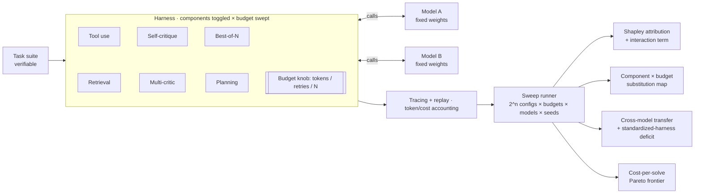

# Elicitation Harness

*The harness changes what a model scores — that much is now settled. This measures **which components** carry the change, **how they trade off against raw compute budget**, and **whether that structure transfers across models** or has to be re-tuned for each one.*

> **Premise (established, not our contribution):** A model's measured capability depends on the harness around it, not the weights alone, so a single-shot score is a lower bound, not a ceiling. This is now the stated position of OpenAI, UK AISI, and METR (see [Background](#background--prior-work)).
>
> **Open question (our contribution):** Given that the harness moves the score, *which components move it, by how much, how do they substitute for token budget, and does the answer transfer across models?* OpenAI's evals playbook names exactly this — understanding when and how harness choices change results across context management, tool access, retry behavior, scoring, and budget — as an open research area. This tool attacks it head-on.

*(Working name — rename freely.)*

---

## Contents

- [Why this exists now](#why-this-exists-now)
- [What's actually novel here](#whats-actually-novel-here)
- [The questions we test](#the-questions-we-test)
- [How it works](#how-it-works)
- [Install](#install)
- [Quickstart](#quickstart)
- [Scaffold components and the budget axis](#scaffold-components-and-the-budget-axis)
- [Methodology](#methodology)
- [Findings](#findings)
- [Framing in evaluation terms](#framing-in-evaluation-terms)
- [Repo structure](#repo-structure)
- [Reproducibility](#reproducibility)
- [Real-world applications](#real-world-applications)
- [Limitations](#limitations)
- [Background & prior work](#background--prior-work)
- [Roadmap](#roadmap)
- [License & citation](#license--citation)

---

## Why this exists now

A year ago you could argue that benchmark scores are harness-dependent and it would be a contribution. As of mid-2026 it is consensus: frontier labs and evaluators now agree that for agentic systems, the harness — prompts, tools, retries, memory, budget — can change the observed score or even decide whether a capability shows up at all. UK AISI found that raising the token budget on a cyber range from 10M to 100M improved performance by up to ~59%, with the curve still climbing at the top of the range. HAL found that swapping the harness on CORE-Bench changed both the score and the cost profile of the same benchmark. OpenAI's third-party evals playbook formalizes the whole thing and calls strong harness/elicitation methods an open research area.

So "the harness matters" is not a finding anymore. What remains unmeasured is the **structure** of the effect: every published example operates at the whole-harness or whole-budget level. None of them decompose *which component* is responsible, whether components interact, how each one trades against simply spending more tokens, or whether the contribution structure is stable across models. That decomposition — done reproducibly, on open weights, as a tool others can run — is the gap this fills.

## What's actually novel here

To be explicit about the line between settled and new, because it's the whole point of the project:

| Already established (we cite, don't claim) | What we measure (the contribution) |
|---|---|
| The harness changes measured capability | *Which* components carry the change, via per-component attribution |
| More budget → higher scores | The **component × budget substitution structure**: which components stop mattering once you can afford more tokens, and which add capability budget never buys |
| Whole-harness swaps change scores and cost | Per-**component** cost-per-solve frontier |
| Standardized vs max-elicitation harnesses differ | Whether the per-component contribution **transfers across models**, and if not, how unevenly a standardized harness under-elicits different models |

If any of the right-hand results come out flat (uniform attribution, no component–budget interaction, perfect cross-model transfer, no rank changes), that is itself a clean, reportable result: it would mean standardized harnesses are unbiased and cheap evals are safe. The project is designed so the null is publishable.

## The questions we test

Four falsifiable claims, each a figure, each going beyond the settled premise:

1. **Attribution is concentrated and non-additive.** A small subset of components carries most of the gap, and they interact — the measured interaction term (full gap minus the sum of individual marginal gains) is non-zero. *Novel because the literature reports whole-harness effects, never a per-component interaction map.*
2. **Components and budget are partial substitutes.** Plotted over a token-budget sweep, some components' marginal value collapses as budget rises (they buy what extra compute would have bought anyway) while others hold their value at every budget. *Directly engages AISI's budget-scaling result by asking which components survive at high budget.*
3. **The attribution may not transfer (the headline).** The per-component contribution ranking is either stable or unstable across models and sizes. If unstable, a single standardized harness under-elicits some models more than others — a measurable, uneven **standardized-harness deficit** that biases controlled comparisons rather than merely adding noise. *Turns OpenAI's standardized-vs-max-elicitation tension into a measured bias.*
4. **Comparisons flip under harness/budget choice.** Model A can beat B bare and lose once both are scaffolded (or at a different budget), so a controlled comparison's verdict depends on a harness choice that reports rarely state. *Novel framing of comparison validity, the article's second claim type.*

## How it works



Models sit behind one interface (local vLLM and hosted APIs are the same path). Each component is an independently toggleable plugin, and **budget is a first-class swept axis** alongside the discrete toggles. The runner sweeps components × budget × model × seed; the four analysis blocks are the novel outputs.

## Install

```bash
git clone https://github.com/<you>/elicitation-harness && cd elicitation-harness
uv venv --python 3.11 && source .venv/bin/activate
uv pip install inspect-ai openai
uv pip install "inspect_evals @ git+https://github.com/UKGovernmentBEIS/inspect_evals"
cp .env.example .env   # add one provider key
```

## Quickstart

Confirm the stack, then run an attribution slice:

```bash
inspect eval inspect_evals/gsm8k --model openai/gpt-4o-mini --limit 20   # smoke test
inspect view
python run_ablation.py                                                   # component slice
```

Reproduce the headline study (component × budget × two models):

```bash
elicit run --config experiments/transfer_and_budget.yaml
elicit report experiments/transfer_and_budget.yaml   # writes results/ + figures/
```

```yaml
# experiments/transfer_and_budget.yaml
models:
  - {name: small, endpoint: http://localhost:8000/v1}   # same family, two sizes
  - {name: large, endpoint: http://localhost:8001/v1}
tasks: suites/swe_verified_mini
components: [tool_use, retrieval, self_critique, multi_critic, best_of_n, planning]
budgets:   [low, mid, high]      # token / retry / N caps, swept as an axis
ablation:  shapley               # exact over 2^n component configs
seeds:     5
budget_usd: 60
```

## Scaffold components and the budget axis

Each component is one elicitation technique; **mode** flags whether it surfaces latent ability (*reveals*) or extends the system (*augments*). Budget (tokens, retries, samples) is swept separately so we can see components and compute trade against each other.

| Component | Mode | What it does |
|---|---|---|
| Tool use | augments | Function calling (code execution, calculator); often the biggest lever. |
| Retrieval | augments | Pulls context into the prompt; reduces hallucination. |
| Self-critique | reveals | Model reviews and revises its own answer. |
| Multi-critic | reveals | Separate critics score/adjudicate; watch judge–benchmark circularity. |
| Best-of-N | reveals | Sample N, select by vote/judge; couples tightly to the budget axis. |
| Planning | reveals | Decompose before executing; long-horizon help, often weak ROI. |

```python
class Component(Protocol):
    name: str
    mode: Literal["reveals", "augments"]
    def wrap(self, call: ModelCall, ctx: TaskContext, budget: Budget) -> ModelCall: ...
```

## Methodology

- **Verifiable tasks only**, so scores rest on execution/ground truth, not a fallible judge: GSM8K for the slice, then SWE-bench Verified Mini (execution-graded) for the headline.
- **Shapley attribution + interaction term.** With 6 components, all 64 configs run exactly; each component gets principled credit across orderings, and the interaction term (full gap − Σ marginal gains) quantifies non-additivity. Naive leave-one-out is reported alongside to show where they disagree.
- **Component × budget sweep.** Re-run the attribution at several budgets; the deliverable is a 2D map of marginal contribution vs budget, exposing substitution.
- **Cross-model transfer.** Compute the attribution per model; report Spearman/Kendall correlation of the component rankings across models, plus the per-model standardized-harness deficit (best config − fixed config).
- **Cost-normalized.** Everything plotted against tokens/USD; primary efficiency metric is expected cost per successful solve, per the article's recommendation.
- **Validity hazards**, screened every run using the now-standard taxonomy — reward hacking, contamination, broken problems, refusals, sandbagging — with a held-out/private slice to catch contamination on reused benchmarks.
- **Statistics.** ≥5 seeds; every number a mean with a bootstrap CI; differences inside the band reported as indistinguishable. Paired tests (McNemar / bootstrap on the difference) for config-vs-config since they share tasks.

## Findings

> Bracketed values are placeholders showing the *shape* of each result; replace with your run. The harness regenerates the table and every figure from `results/`.

**Attribution + interaction.** On `[small model]` / `[SWE-bench Verified Mini]`, `[two of six]` components carry `[~80%]` of the gap; the interaction term is `[+N pts]`, so the components are `[super/sub]`-additive — the harness is not the sum of its parts.

**Component × budget substitution.** `[best_of_n / planning]`'s marginal contribution `[falls from +X to ~0]` as budget rises from low to high, while `[tool_use]` holds `[+Y]` at every budget — i.e. `[best-of-N]` mostly buys what extra compute buys anyway, `[tool use]` does not.

**Cross-model transfer (headline).** The component ranking correlates `[ρ = 0.?]` between `[small]` and `[large]`. `[If low:]` the same standardized harness under-elicits `[large]` by `[Z pts]` more than `[small]`, so a fixed-harness comparison is `[biased toward / against]` the larger model — not just noisier.

**Comparison flips.** Under a `[low-budget standardized]` harness `[A > B]`; under `[max-elicitation]` `[B > A]`. The verdict of a "controlled comparison" depends on a harness choice usually left unreported.

If instead attribution is uniform, no component–budget interaction appears, transfer is near-perfect, and no flips occur — that null says standardized harnesses are safe and is reported as such.

## Framing in evaluation terms

Outputs map onto the claim types now used by evaluators and emerging standards. The full-scaffold-at-high-budget config is a **capability-under-strong-elicitation** estimate (a lower bound). The fixed shared config is a **standardized-harness comparison**. The novel bit is measuring the *distance between them per model* — the standardized-harness deficit — which is exactly what determines whether a controlled comparison is trustworthy. The tool lets an evaluator move between the two regimes and see, per component, what each costs and elicits.

## Repo structure

```
elicitation-harness/
├── src/elicit/
│   ├── models/        # one interface; local vLLM + hosted are the same path
│   ├── components/    # toggleable scaffold plugins (budget-aware)
│   ├── budget/        # token/retry/N caps swept as an axis
│   ├── tasks/         # verifiable task loaders + scoring
│   ├── runner/        # components × budget × model × seed sweeps, cost accounting
│   ├── attribution/   # Shapley + interaction term + transfer metrics
│   └── analysis/      # substitution map, deficit, cost-per-solve Pareto
├── experiments/       # YOUR studies as config (transfer_and_budget.yaml, ...)
├── results/           # committed raw outputs
├── figures/           # regenerated from results/
├── suites/            # task suites
└── writeup/           # the report / blog post
```

Core framework is reusable and model/task-agnostic; your specific study lives in `experiments/` as one configuration, so a stranger can rerun it or point it at their own models and tasks.

## Reproducibility

Pinned model/dependency versions, fixed seeds, committed `results/`, one-command figure regeneration, and full transcripts via Inspect. Honest caveat: even at temperature 0 outputs are not perfectly deterministic (batching, hardware, float order), which is why every number is a mean over seeds with a CI rather than a single run.

## Real-world applications

- **For evaluators and AI safety institutes:** the standardized-harness deficit directly answers whether a fixed-harness comparison is biased, and per-component attribution tells you which harness features a comparison must hold constant to stay valid. This is the practical core of the OpenAI playbook, measured.
- **For model selection:** the component × budget substitution map plus cost-per-solve says which model-plus-scaffold meets a bar most cheaply — and warns when a bare-eval ranking would have picked wrong.
- **For agent teams:** per-component attribution shows which scaffolding earns its latency and which is dead weight, and at which budgets.
- **For capability forecasting / risk:** under-elicitation under-reports dangerous capability; this quantifies how much, and shows whether a standardized eval systematically under-elicits some models.

## Limitations

- **We do not claim to discover that the harness matters** — that is established. The contribution is the decomposition, the substitution structure, and the transfer result.
- Inference-time elicitation only (no fine-tuning), so results bound elicited capability, a lower bound on a lower bound.
- Findings are specific to the tested suites, model families, and budget range; generality is what the tool lets others test.
- "Capability" = task success under a scoring rule, a deliberately narrow proxy.

## Background & prior work

- OpenAI, *A shared playbook for trustworthy third party evaluations* (May 2026) — the harness/elicitation playbook and claim-type framing. https://openai.com/index/trustworthy-third-party-evaluations-foundations/
- UK AISI cyber range evaluation — budget scaling (10M→100M tokens, up to ~59%). https://arxiv.org/pdf/2603.11214
- HAL (Holistic Agent Leaderboard) — harness changes performance and cost on CORE-Bench. https://hal.cs.princeton.edu/
- METR time-horizon evaluations — standardized scaffolds, Vivaria→Inspect migration. https://metr.org/time-horizons/
- Anthropic, *Demystifying evals for AI agents* — execution-based grading for coding agents. https://www.anthropic.com/engineering/demystifying-evals-for-ai-agents

## Roadmap

Same machinery, pointed at safety: **control under chain-of-thought monitoring** — does exposing an untrusted agent's reasoning to a weaker monitor help catch sabotage, or teach the agent to launder intent? Reuses the components, tracing, budget axis, and model interface built here.

## License & citation

MIT.

```bibtex
@software{elicitation_harness,
  author = {<Your Name>},
  title  = {Elicitation Harness: decomposing the harness contribution to LLM capability},
  year   = {2026},
  url    = {https://github.com/<you>/elicitation-harness}
}
```
