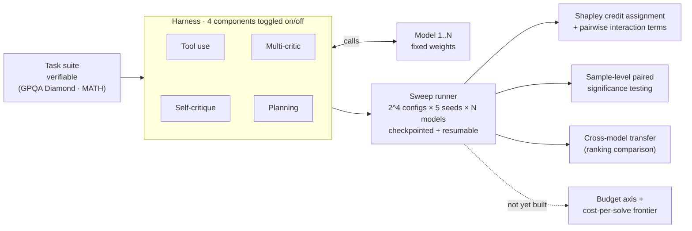

# Elicitation Harness

## What this is

A benchmark number for a language model describes more than just the model itself. It describes the model plus everything wrapped around it: the prompt, whether it can call tools, whether it gets a second attempt, how many tokens it's allowed to burn, how the answer gets graded. That wrapper is usually called the **harness** (or scaffold), and the work of tuning it so the model actually shows what it can do is called **elicitation**.

Nobody disputes that the harness affects the benchmark score. OpenAI, the UK AI Security Institute, and METR have all said so publicly. What nobody has measured is HOW the harness affects it: which pieces of the harness are doing the work, whether those pieces help/hurt each other, how each one compares to just spending more money on tokens, and whether any of that stays the same when you swap in a different model. This repo runs that measurement.

---

## Contents

- [Why this matters](#why-this-matters)
- [What's new here](#whats-new-here)
- [The four things we test](#the-four-things-we-test)
- [How it works](#how-it-works)
- [Components and the budget knob](#components-and-the-budget-knob)
- [Methodology](#methodology)
- [Findings](#findings)
- [How this maps onto evaluation vocabulary](#how-this-maps-onto-evaluation-vocabulary)
- [Repo structure](#repo-structure)
- [Reproducibility](#reproducibility)
- [Limitations](#limitations)
- [Prior work](#prior-work)
- [Roadmap](#roadmap)
- [License](#license)

---

## Why this matters

Research has been done to conclude that benchmark scores depend on the harness. This is now a basic assumption. Here's more information:

- The UK AI Security Institute ran a cyber security evaluation where raising the token budget from 10 million to 100 million improved performance by as much as 59 percent, and the curve hadn't flattened out even at the top of the range.
- HAL (the Holistic Agent Leaderboard) swapped harnesses on the same benchmark, CORE-Bench, and got different scores *and* different costs out of identical models.
- OpenAI's playbook for third party evaluations writes all of this down formally and lists strong elicitation methods as an open problem.

The problem is that every one of those results depends on the whole harness or the whole budget and not the specific contributions of the harness. If the harness is swapped, the number changes, but we don't know exactly which single component was responsible, whether two components together do more than the sum of what they do separately, or how each one stacks up against just using more tokens. This gap is what this project aims to fill.

### The practical version of the same problem

There's a second reason this is worth doing right now. A lot of production traffic is migrating off closed API providers like OpenAI and Anthropic and onto open-weight models, either self-hosted or served by companies that specialize in running open models cheaply (Together, Fireworks, and similar). At scale, the math usually favors using open-weight models.

But calling a closed API gets you more than just model weights. The provider has already written a tuned default system prompt, layered on safety scaffolding, and figured out sensible retry and elicitation behavior. When a company spins up an open-weight model themselves, none of that comes with it. The company now owns the entire elicitation question.

So for those teams this is a build versus buy question. Which scaffold pieces are worth the engineering time, and how much capability does a rushed migration cost you compared to one where somebody actually tuned the harness?

## What's new here

| Already known | What we actually measure |
|---|---|
| The harness changes measured capability | Which components carry the change, with per component credit assignment |
| More budget means higher scores | How components and budget substitute for each other: which components stop mattering once you can afford more tokens, and which don't |
| Swapping whole harnesses changes score and cost | Cost per solved task, broken down per component |
| Standardized and max effort harnesses give different numbers | Whether the per component ranking transfers across models, and if it doesn't, how unevenly a fixed harness shortchanges different models |

If everything on the right comes out flat (credit spread evenly, no interaction with budget, rankings transfer perfectly, no ranking flips), that's still worth reporting. It would mean standardized harnesses are unbiased and cheap evaluations can be trusted, which is also a useful outcome to report.

## The four things we test

**1. Credit is concentrated, and the parts aren't independent.**

We expect a small number of components to account for most of the improvement, and we expect them to interact. The way to check is to measure the gap between the bare model and the full harness, then subtract the sum of what each component contributes on its own. If that leftover is not zero, the harness is more (or less) than the sum of its parts. 

**2. Components and budget partly substitute for each other.**

Run the same analysis at several token budgets. Some components should lose their value as budget rises, because they were buying you something extra compute would have bought anyway. Others should hold their value no matter how much you spend. This is the direct follow up to the AISI budget scaling result: more tokens help, but which parts of the harness are still contributing at 100 million tokens?

**3. The ranking may not transfer. This is the one we care most about.**

Compute the per component ranking separately for each model. Either it's stable across models and sizes, or it isn't. If it isn't, then a single fixed harness is leaving more capability on the table for some models than for others. 

**4. Head to head comparisons can flip.**

Model A beats model B with no scaffolding, then loses once both are fully scaffolded. Or the winner changes when you change the budget. If that happens, then the verdict of a "controlled comparison" depends on a harness decision.

## How it works



Each of the four components (`critique`, `tool_use`, `planning`, `multi_critic`) is a boolean toggle threaded through `build_solver()` in `elicit_task.py`. There's no separate plugin package; adding a component means adding a toggle and a solver function in one file. `run_shapley_sweep.py` runs every 2⁴=16 on/off combination × 5 seeds × however many models are currently in `MODEL_PAIR`, checkpointing after every seed. An interrupted sweep resumes from wherever it left off instead of restarting.

Two of the original six components aren't in that sweep. `retrieval` was built (BM25 over a Wikipedia corpus) and then dropped. Three real bugs plus an untested relevance question made it the least trustworthy component in the codebase, so it's commented out in `elicit_task.py` instead of deleted. `best_of_n` was never built: its whole point is trading off against a budget axis, and that axis doesn't exist yet. `chain_of_thought` (`cot`) exists as a toggle but sits outside this sweep. It was measured in an earlier, separate bare/cot/critique/cot+critique ablation (`run_ablation.py`) on both suites; the current interaction study attributes credit to the other four toggles only.

**There's no budget axis yet.** `MAX_TOKENS` and `MAX_CONNECTIONS` in the runner scripts are fixed operational caps, needed to stay inside a model's context window and keep concurrency well-behaved. They aren't swept low/medium/high the way the components are. The component × budget substitution analysis described below is still on the roadmap; it hasn't been implemented.

Models sit behind Inspect AI's provider layer, so switching models is a one-line config edit. The roster has already moved once. A Together-hosted pair (`Qwen2.5-7B-Instruct-Turbo` and `gemma-3n-E4B-it`) completed a full GPQA sweep, then the study switched to DeepInfra for cost with three larger models: `Qwen3-32B`, `gemma-3-27b-it`, and `Qwen2.5-72B-Instruct`. That trio is currently running the same 16-config sweep on MATH (intermediate_algebra).

## Components and the budget knob

Each component is one technique for getting more out of a model. The **mode** column marks whether it uncovers ability the model already had (reveals) or bolts on a capability the model didn't have (augments). The **status** column tracks what actually happened to each of the original six, since two didn't make it into the current study.

| Component | Mode | Status | What it does |
|---|---|---|---|
| Tool use (`tool_use`) | augments | Active | Lets the model call a sandboxed Python tool. Capped at a 30s per-call timeout and an identical-call repeat guard, added after a runaway tool-call loop on one model burned 15-40x the token budget of every other config in a sweep |
| Self-critique (`critique`) | reveals | Active | The model reads its own answer and revises it (Inspect's built-in `self_critique()`) |
| Multi-critic (`multi_critic`) | reveals | Active | A second model critiques and revises the primary model's answer, using a thin wrapper around `self_critique(model=...)`. In the sweep the critic is always the other model in the pair, so it functions as a genuine cross-model check on top of `critique` |
| Planning (`planning`) | reveals | Active | A separate generation turn asks for a numbered plan before the model answers, followed by an explicit "now answer" instruction. The first version silently collapsed to near-zero accuracy because it lacked that follow-up instruction; without it, the model just kept extending the plan instead of answering |
| Chain-of-thought (`cot`) | reveals | Built, separate ablation | Standard CoT, measured in an earlier, standalone bare/cot/critique/cot+critique ablation on GPQA and MATH. It sits outside the four toggles in the current Shapley sweep |
| Retrieval (`retrieval`) | augments | Dropped (code retained, commented out) | BM25 over a built Wikipedia corpus. Built, then dropped after three real bugs and an untested relevance question made it the least trustworthy component in the codebase |
| Best-of-N (`best_of_n`) | reveals | Never built (deferred) | Generate N answers, pick one by voting or by judge. Deferred because its whole point is trading off against a budget axis, and that axis doesn't exist yet |

There's no `Component` plugin class or protocol. The architecture is a monolithic `elicit_task.py`; each active component is just a boolean parameter composed by one shared function:

```python
def build_solver(
    cot: bool, critique: bool, system_prompt: str,
    tool_use: bool = False, use_retrieval: bool = False, use_planning: bool = False,
    use_multi_critic: bool = False, critic_model: str | None = None,
    critic_config: GenerateConfig | None = None,
):
    ...  # assembles system_message + whichever solver steps are toggled on, in a fixed order
```

**There is no budget knob yet.** `MAX_TOKENS` and `MAX_CONNECTIONS` in the runner scripts are fixed per-run caps for cost and reliability, not a swept experimental axis. "Budget" currently means what a single call is allowed to spend. Measuring components against budget as a variable is still future work.

## Methodology

**Only tasks with checkable answers.** Scores come from running code or comparing against ground truth, never from asking another model whether the answer looks good. GSM8K was tried first and rejected (bare accuracy too close to ceiling to have statistical power); GPQA Diamond is the primary suite, MATH (intermediate algebra) the secondary one, and HumanEval the code-execution suite, graded by actually running the tests against the model's generated function.

**Credit assignment using Shapley values, plus an interaction term.** Shapley values come from cooperative game theory. The idea: to work out how much one player contributed to a team, you look at every possible order the players could have joined in, and average how much the score went up when that player showed up. With however many components are toggled on, there are exactly 2ⁿ combinations, small enough (for the component counts used here) to run every one and get the exact answer rather than an estimate. Then we take the full gap between bare and scaffolded, subtract the sum of the individual contributions, and report the leftover. That leftover is the interaction: positive means the components amplify each other, negative means they get in each other's way. We also report plain leave-one-out numbers (turn off one component, see what you lose) so you can see where the two methods disagree.

**The budget sweep.** Redo the whole credit assignment at low, medium, and high budget. The output is a 2D map: component on one axis, budget on the other, contribution as the value. Substitution shows up as a component's contribution fading out to the right.

**Cross model transfer.** Run the credit assignment separately per model, then check whether the two rankings agree using Spearman and Kendall correlation (both are standard ways to ask "do these two ranked lists put things in the same order"). Then, per model, measure the gap between its best configuration and the shared fixed configuration. That gap is how much a standardized harness is costing that particular model.

**Everything normalized by cost.** All results get plotted against tokens and dollars. The headline efficiency number is expected cost per task actually solved, which is more informative than accuracy alone because a config that solves 5 percent more tasks at 4x the price is not obviously better.

**Screening for things that would invalidate the results.** Every run gets checked for reward hacking (the model games the scoring rule instead of doing the task), contamination (the test data was in training data), broken problems (the task itself is unsolvable or mislabeled), refusals, and sandbagging (the model underperforming on purpose). A held out private slice catches contamination on benchmarks that have been floating around the internet for a while.

**Statistics.** At least 5 seeds per configuration. Every number is a mean with a bootstrap confidence interval, which means we resample the results many times to estimate how much the number would wobble if we ran it again. Differences that fall inside the interval get reported as "can't tell these apart," not as small wins. For comparing two configurations we use paired tests (McNemar, or bootstrap on the per task difference) since both configurations ran the same tasks.

## Findings

**Status: 2 of 3 models (`Qwen2.5-72B-Instruct`, `Qwen3-32B`), MATH intermediate_algebra, DeepInfra.** `gemma-3-27b-it`'s identical sweep is still running, so this is a two-model headstart rather than the full cross-model result. Every number below comes from a real, FDR-corrected, sample-level significance test (`shapley_significance_test.py`, n=1250 paired observations per test, Benjamini-Hochberg correction across all 20 tests). Full detail lives in [`writeup/findings.md`](writeup/findings.md), including a validity caveat that changes how the `tool_use` finding should be read. Check that file before citing any of these numbers elsewhere.

**Credit and interaction.** On `Qwen2.5-72B-Instruct`, `multi_critic` alone (+0.161, p<0.0001) accounts for 43% of the entire four-component lift (bare 0.263 to full-stack 0.636, +0.373 total). `tool_use` follows at +0.107, `critique` at +0.066, `planning` at +0.028; all four main effects are significant. The interaction term between `tool_use` and `multi_critic` is −0.121 (p<0.0001), meaning the two strongest individual components actively work against each other when combined. On `Qwen3-32B`, the whole four-component harness barely moves accuracy at all (+0.009 total, inside noise). `multi_critic` still lands positive and significant at +0.073, but `tool_use` (−0.076) and `critique` (−0.015) are small and negative, wiping out most of that gain.

**Substitution with budget.** Not yet measured. Budget isn't an axis in this study yet (see Limitations).

**Transfer across models.** Ranking the four components by main-effect size gives Spearman ρ = 0.2 between `Qwen2.5-72B-Instruct` and `Qwen3-32B`, close to no correlation. `multi_critic` (rank 1 on both) and `critique` (rank 3 on both) agree. `tool_use` and `planning` swap positions entirely, and `tool_use`'s effect flips sign between the two models (+0.107 vs −0.083, both significant, both surviving correction). With only 4 components, ρ carries wide uncertainty on its own, so read 0.2 as a signal worth investigating further rather than a settled number.

**Flipped comparisons.** Bare, `Qwen3-32B` beats `Qwen2.5-72B-Instruct` by a wide margin (0.564 vs 0.263). Fully scaffolded, `Qwen2.5-72B-Instruct` edges ahead instead (0.636 vs 0.573). One important caveat here: a spot-check of `Qwen3-32B`'s bare-condition transcripts found visible chain-of-thought leaking into 8 of 12 sampled answers, despite the system prompt saying not to show its work. That likely inflates its bare score with reasoning the harness wasn't supposed to be crediting it for. Both this flip and the `tool_use` sign flip above are statistically solid, but they shouldn't be treated as fully clean results until that leak gets fixed or measured at scale (open item, see `writeup/findings.md`).

If credit turns out to be spread evenly, budget doesn't interact with anything, rankings transfer cleanly, and nothing flips, standardized harnesses are safe and that's exactly what we'd report. So far, the data isn't showing that.

## How this maps onto evaluation vocabulary

Evaluators tend to distinguish two kinds of claim. Running the full scaffold at high budget gives you a **capability under strong elicitation** estimate, which is a lower bound on what the model can do. Running a shared fixed configuration across models gives you a **standardized comparison**, which is what you want when the point is to compare models rather than harnesses.

The interesting quantity is the distance between those two, measured separately for each model. If the distance is the same for everyone, the standardized comparison is fine. If it isn't, the comparison is measuring the harness as much as the models. This tool lets you sit in either regime and see, per component, what each one costs you and what it gets you.

## Repo structure

The logic lives in root-level scripts. An earlier version of this README described a `src/elicit/` package layout instead; that package still exists only as empty stubs.

```
elicitation-harness/
├── elicit_task.py                # task/suite adapters (gsm8k, math, gpqa, humaneval) + every
│                                  #   component toggle, composed by build_solver()
├── run_ablation.py                # bare/cot/critique/cot+critique ablation sweep
├── run_shapley_sweep.py           # 2^4-config × 5-seed × N-model Shapley sweep, checkpointed
├── math_pilot.py                  # small pilot runs: headroom check + real per-component token costs
├── power_analysis.py              # required-N per effect, from real pilot data
├── mcnemar_test.py                # paired significance test (single-run and pooled modes)
├── shapley_attribution.py         # exact Shapley values + pairwise interaction terms, bootstrap CIs
├── shapley_significance_test.py   # sample-level paired significance test on Shapley effects
├── spot_check.py                  # scorer false-positive/false-negative spot-checking
├── build_retrieval_corpus.py      # Wikipedia corpus builder for the (currently dropped) retrieval component
├── results/                       # raw outputs (accuracy per config/seed, log paths), committed
├── suites/                        # retrieval corpus + contamination report
├── logs/                          # full Inspect transcripts (.eval files)
├── src/elicit/                    # early package skeleton, unused stubs
└── writeup/
    ├── process_log.md             # running record of what was tried and what was found
    └── ...                        # the eventual polished report
```

## Reproducibility

Pinned dependency versions (`requirements.txt`), fixed seeds, `results/` committed to the repo with every run checkpointed after each seed, and full transcripts saved through Inspect (`logs/`). Every reported statistic is recomputed directly from `results/` by its own script (`mcnemar_test.py`, `shapley_attribution.py`, `power_analysis.py`). There's no separate figure-generation step yet, so "regenerate the figures" isn't a real command at this point.

Even at temperature 0, model outputs are not perfectly reproducible. Batching, hardware differences, and floating point ordering all introduce small variations. Every number here is a mean over multiple seeds with an interval attached rather than a single run reported as fact.

## Limitations

- We are not claiming to have discovered that the harness matters, since that has been established. The contribution is the breakdown, the substitution structure, and the transfer result.
- Inference time only, no fine-tuning. The results bound elicited capability, which is already a lower bound on what the weights can do.
- Results are specific to the task suites, model families, and budget range tested. Whether they generalize further has not yet been checked.
- "Capability" here means task success under a particular scoring rule. 

## Prior work

- OpenAI, *A shared playbook for trustworthy third party evaluations* (May 2026). The harness and elicitation playbook, and the claim type framing. https://openai.com/index/trustworthy-third-party-evaluations-foundations/
- UK AISI cyber range evaluation. Budget scaling from 10M to 100M tokens, up to roughly 59 percent improvement. https://arxiv.org/pdf/2603.11214
- HAL (Holistic Agent Leaderboard). Harness swaps change both performance and cost on CORE-Bench. https://hal.cs.princeton.edu/
- METR time horizon evaluations. Standardized scaffolds, and the Vivaria to Inspect migration. https://metr.org/time-horizons/
- Anthropic, *Demystifying evals for AI agents*. Execution based grading for coding agents. https://www.anthropic.com/engineering/demystifying-evals-for-ai-agents

## Roadmap

Same machinery, pointed at a safety question: **control under chain of thought monitoring**. If you show an untrusted agent's reasoning to a weaker monitor model, does that help catch sabotage, or does it just teach the agent to hide its intent inside plausible looking reasoning? That study reuses the components, the tracing, the budget axis, and the model interface built here.

## License

MIT
